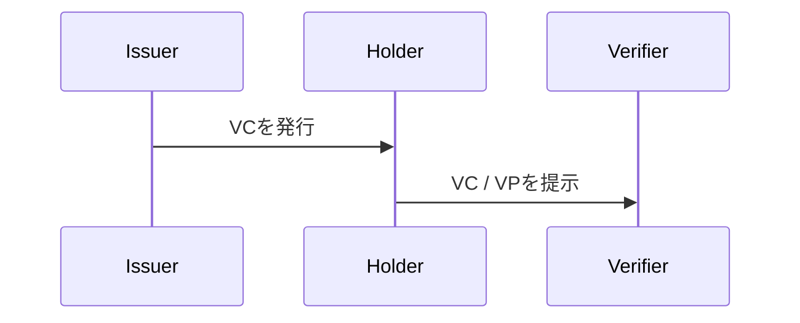

# Learn Authoring Workflow

learnはMarkdownをSource of Truthにします。

```text
依頼
↓
自然な説明Draft
↓
必要なFactだけ一次情報で確認
↓
Markdown
↓
必要な箇所だけMermaid
↓
contents/<domain>/<collection>/<note>.md
↓
GitHubへPush
↓
GitHub Actions / Astro
↓
Cloudflare Workersへ公開
```

## Source

通常ノートは原則として以下へ置きます。

```text
contents/<domain>/<collection>/<note>.md
```

表示上の配置はファイルPathではなくFront Matterの`directoryId`、`domainId`、`collectionId`、`order`で決まります。
そのため、既存URLやファイルPathを壊さずに表示位置だけ変更できます。

## Front Matter

```yaml
---
id: did-overview
permalink: /identity/did-vc/did.html
title: DIDとは何か
description: DIDをMental ModelからResolutionまで理解する
type: Note
order: 10
domainId: identity
domainName: Identity
collectionId: did-vc
collectionName: DID / VC
spec: W3C DID Core v1.0
reviewed_at: "2026-08-29 12:00 JST"
---
```

Astroは`permalink`を既存URLとしてそのまま維持します。
通常Noteは`.html`、Directoryは末尾`/`の`index.html`として生成します。

## Note Directory

複数ノートを1つのまとまりとして公開したい場合は`Directory`を使います。
Directory本体も`contents/<domain>/<collection>/`配下へ置き、`type: Directory`を指定します。

```yaml
---
id: x402-spec-ja
permalink: /payments/x402/spec-ja/
title: x402 v2仕様リサーチ
description: x402 Protocol Specification v2を章ごとに調査したDirectory
sourceLabel: x402 Protocol Specification v2
type: Directory
order: 30
directoryId: x402-notes
domainId: payments
domainName: Payments
collectionId: x402
collectionName: x402
official: https://github.com/x402-foundation/x402/blob/main/specs/x402-specification-v2.md
reviewed_at: "2026-08-30 11:50 JST"
---
```

Directoryへ入れる通常ノートには`directoryId`を追加します。
`order`はその場所での表示順です。
Nested Directoryも同じ`directoryId`で親Directoryを指定します。

```yaml
---
id: x402-spec-ja-introduction
permalink: /payments/x402/spec-ja/introduction.html
title: x402 v2の全体像
type: Note
order: 10
directoryId: x402-spec-ja
domainId: payments
domainName: Payments
collectionId: x402
collectionName: x402
---
```

Directoryに所属するノートはカテゴリ一覧へ単体では重複表示されません。
カテゴリ直下ではStandalone NoteとTop-level Directoryを同じ`order`で並べます。
Directoryを開くと、その子Note / 子Directoryも`order`順に並びます。

## 記事を移動する

表示位置の変更には`scripts/note-placement.py`を使います。
このScriptは`directoryId`だけでなく、移動先Directoryの`domainId`、`domainName`、`collectionId`、`collectionName`も同期し、最後にDirectory Validatorを実行します。

### 任意のDirectoryへ移動する

```bash
python3 scripts/note-placement.py move ap2-overview \
  --directory ap2-v02 \
  --order 20
```

`--order`を省略すると、移動先の末尾へ10刻みで配置します。
Nested DirectoryもDirectory IDを指定すれば同じ方法で移動できます。

### カテゴリ / Collection直下へ戻す

現在と同じCollectionのRootへ戻す場合です。

```bash
python3 scripts/note-placement.py move ap2-overview --root --order 10
```

別CollectionのRootへ移動する場合は、既存CollectionのIDを指定します。

```bash
python3 scripts/note-placement.py move some-note \
  --root \
  --domain payments \
  --collection ap2 \
  --order 30
```

移動は**表示上のHierarchyと順序**を変更します。
既存`id`、ファイルPath、`permalink`は自動変更しません。
URLも変更したい場合は別のMigrationとして扱います。

## 配置を固定する

Noteの表示位置を固定する場合はFront Matterへ`placementLocked: true`を設定します。
手編集よりCommandを使う方を推奨します。

```bash
python3 scripts/note-placement.py lock ap2-overview
```

ロック中は以下の配置情報を変更できません。

- `directoryId`
- `domainId`
- `domainName`
- `collectionId`
- `collectionName`
- `order`

本文、Title、Description、Source、`reviewed_at`などは通常どおり更新できます。

CIの`scripts/validate-directories.py`はGit履歴の直前状態と比較します。
前Commitで`placementLocked: true`だったNoteについて、配置変更、削除、ID変更を検知するとDeploy前にFailします。

### ロックしたNoteを移動する時

ロック解除と移動を同じCommitでは行えません。
誤操作でロックを外しながら移動できないよう、必ず2段階にします。

1. ロックだけを解除します。

```bash
python3 scripts/note-placement.py unlock ap2-overview
git add contents/
git commit -m "Unlock AP2 overview placement"
```

2. 解除Commitが成立した後で移動します。

```bash
python3 scripts/note-placement.py move ap2-overview \
  --directory ap2-v02 \
  --order 20
git add contents/
git commit -m "Move AP2 overview"
```

ロック中に直接`directoryId`や`order`を書き換えた場合もCIが拒否します。

### 移動と同時に新しい場所を固定する

現在UnlockedのNoteなら、移動先で同時にLockできます。

```bash
python3 scripts/note-placement.py move ap2-overview \
  --directory ap2-v02 \
  --order 20 \
  --lock
```

### 現在の状態を確認する

```bash
python3 scripts/note-placement.py status ap2-overview
```

## Details

Sourceでは標準HTMLの`<details>/<summary>`を使い、中身は通常のMarkdownで書きます。
`scripts/prepare-astro.mjs`がAstro Build前にdetails本文だけをHTML化し、Definition形式をレスポンシブ表示用のDOMへ変換します。
生成後HTMLへの書き換えは行いません。

## Mermaid

説明図はMermaidだけを使います。



FlowやSequenceを文章だけで追いづらい時に使います。
単純な比較はTableを優先します。

## Build and Deploy

ローカルBuildです。

```bash
npm install
npm run build
```

`npm run build`は以下を行います。

1. `scripts/prepare-astro.mjs`でMarkdownをAstro Content Collection用に準備します。
2. Astroが静的HTMLとfingerprint済みAssetsを`dist/`へ生成します。
3. 検証・Cloudflare配信用に同じ成果物を`_site/`へコピーします。

Deploy Workflowでは以下を必須検証します。

1. Astro SourceのGlobal Header / Outline ownership。
2. Directory / Nested Directoryの整合性。
3. `placementLocked`の履歴比較。
4. Note placement toolingのLock / Unlock / Move動作。
5. Astro Buildが正確に64ページを生成すること。
6. Global HeaderとDirectory UIの生成結果。
7. desktop/mobileのBrowser layout、details、コード表示、記事Outline。
8. 検証済み`_site/`だけをCloudflare WorkersへDeployすること。

Ruby、Jekyll、生成後HTML PostprocessはBuild / Deploy経路で使用しません。
ロック違反、Directory不整合、表示回帰がある状態では本番Deployへ進みません。
