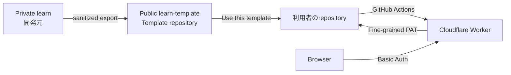

# Learn Template セットアップガイド

このドキュメントだけで、配布用Template repositoryの作成・更新と、利用者が自分専用のLearnをCloudflareへデプロイする手順を完結させます。

## 全体構成

推奨構成は次です。



役割を分離します。

- `learn`
  - privateの開発元です。
  - 個人ノート、研究成果、実運用データを保持します。
- `learn-template`
  - publicの配布専用repositoryです。
  - 個人ノートを含めず、最小サンプルとアプリケーションだけを保持します。
  - GitHubのTemplate repositoryとして設定します。
- 利用者repository
  - `Use this template`から各利用者が作成します。
  - 実際のノートとCloudflare環境は各利用者が所有します。

Templateから作成したrepositoryはforkではないため、利用者のノート履歴と配布元の履歴を分離できます。

## ChatGPT / AIからセットアップする場合

配布Templateにはセットアップ・デプロイ専用Skillを含めます。

```text
.codex/skills/learn-deployer/SKILL.md
```

ChatGPTや対応するAIエージェントへ、例えば次のように依頼します。

```text
learn-deployerを使って、このLearnを自分用にセットアップしてCloudflareへデプロイまで進めて。
```

`learn-deployer`はこの`docs/setup.md`をSource of Truthとして読み、現在のGitHub repository、GitHub Actions、Cloudflare Workerなどを利用可能なToolで確認します。

すでに完了している工程は飛ばし、未完了部分から続行します。Toolで実行できる作業はAI側で実行し、新規repository作成、Token発行、Secret入力など本人操作が必要な箇所だけをCheckpointとして案内します。

Checkpoint完了後は、例えば次のように短く返せば続行できます。

```text
設定した
```

AIは状態を再取得し、最初から手順を繰り返さず続きを実行します。

GitHub PAT、Cloudflare API Token、Basic認証PasswordなどのSecret値は通常のチャットへ貼らないでください。Secret値はGitHub/CloudflareのSecret入力UIまたは安全なSecret書き込み機構へ直接登録します。

`learn-deployer`の完了条件は初回Deployment成功だけではありません。本文編集でMarkdownを読み込み、保存先が利用者自身のrepositoryであることと、そのCommit後の再デプロイまで確認します。

---

# Part A. 配布用Template repositoryを管理する人向け

## 1. 配布物を生成する

privateの`learn` repositoryで依存関係を入れます。

```bash
npm install
```

配布用ファイルを生成します。

```bash
npm run template:export
```

生成先は次です。

```text
_template-repo/
```

このディレクトリには次だけが入ります。

- Astro / Cloudflare Workerのアプリケーション。
- GitHub ActionsのデプロイWorkflow。
- `.codex/skills/`。
- `docs/setup.md`などの共通ドキュメント。
- commerce / identity / paymentsの最小サンプルノート。
- 空の変更履歴・研究run領域。

次は配布対象外です。

- private側の`contents/`。
- `_archive/`。
- 実際の`_data/article_changes.yml`。
- `.codex/research-runs/`の実データ。
- build成果物。
- `node_modules/`。

生成物が正常にbuildできることも確認できます。

```bash
npm run template:check
```

## 2. public repositoryを1回だけ作る

GitHubで空のpublic repositoryを作ります。

推奨名です。

```text
learn-template
```

最初だけ、生成した`_template-repo/`をそのrepositoryへpushします。

例です。

```bash
cd _template-repo
git init
git add .
git commit -m "Initial Learn template"
git branch -M main
git remote add origin git@github.com:YOUR_NAME/learn-template.git
git push -u origin main
```

GitHubの`learn-template`→`Settings`→`General`で`Template repository`を有効にします。

これで利用者に`Use this template`が表示されます。

## 3. 以降のTemplate更新を自動化する

privateの`learn` repositoryに次を設定します。

GitHub Actions Variableです。

| Name | Value |
| --- | --- |
| `TEMPLATE_REPOSITORY` | `YOUR_NAME/learn-template` |

GitHub Actions Secretです。

| Name | Value |
| --- | --- |
| `TEMPLATE_REPOSITORY_TOKEN` | `learn-template`へContents writeできるFine-grained PAT |

PATは配布用repositoryだけへRepository accessを限定し、`Contents: Read and write`だけを付与することを推奨します。

設定後は`.github/workflows/publish-template.yml`がprivate側から配布用treeを生成し、publicの`learn-template`へ同期できます。

Workflowは個人ノートを直接copyせず、必ず`scripts/export-template.mjs`でsanitized treeを作ってから同期します。

手動更新したい時はGitHub Actionsの`Publish distribution template`→`Run workflow`を実行します。

---

# Part B. Learnを使いたい人向け

## 1. Use this templateで自分のrepositoryを作る

publicの`learn-template`を開き、`Use this template`→`Create a new repository`を選びます。

repository名は自由です。

例です。

```text
my-learn
```

ノートを非公開にしたい場合はPrivate repositoryを推奨します。

以降、このrepositoryを`YOUR_NAME/my-learn`として説明します。

## 2. GitHub Fine-grained PATを作る

Cloudflare Workerが編集内容を自分のGitHub repositoryへCommitするためのPATを作ります。

GitHubのFine-grained Personal Access Tokenで次を設定します。

- Repository access
  - `YOUR_NAME/my-learn`だけを選択します。
- Repository permissions
  - `Contents: Read and write`。
- Expiration
  - 運用に合わせて有効期限を設定することを推奨します。

このPATはGitHub Actionsが自動生成する`GITHUB_TOKEN`とは別物です。

発行した値は後で`WORKER_GITHUB_TOKEN`として登録します。

## 3. Cloudflare API Tokenを作る

GitHub ActionsからCloudflare WorkersへデプロイするためのAPI Tokenを作ります。

Cloudflare DashboardのAPI TokensからWorkersを編集できるTokenを作成し、対象Accountだけへscopeを限定します。

次の2値を用意します。

```text
CLOUDFLARE_ACCOUNT_ID
CLOUDFLARE_API_TOKEN
```

## 4. GitHub Actions Secretsを登録する

自分のrepositoryで`Settings`→`Secrets and variables`→`Actions`→`Repository secrets`へ進みます。

次の5つを登録します。

| Secret | 用途 |
| --- | --- |
| `CLOUDFLARE_ACCOUNT_ID` | デプロイ先Cloudflare Account |
| `CLOUDFLARE_API_TOKEN` | WranglerによるWorkerデプロイ |
| `WORKER_BASIC_USER` | サイトへログインするユーザー名 |
| `WORKER_BASIC_PASSWORD` | サイトへログインするパスワード |
| `WORKER_GITHUB_TOKEN` | 自分のrepositoryへ書き込むFine-grained PAT |

`WORKER_BASIC_USER`、`WORKER_BASIC_PASSWORD`、`WORKER_GITHUB_TOKEN`は3つすべて設定してください。

Workflowはこの3値をrunner上の一時secrets fileへ書き、Cloudflareには次のWorker Secret名で登録します。

```text
BASIC_USER
BASIC_PASSWORD
GITHUB_TOKEN
```

Secret値はrepositoryやbuild成果物へ埋め込みません。

## 5. Worker名を必要に応じて変更する

デフォルトのWorker名は`learn`です。

同じCloudflare Account内ですでに`learn`を使っている場合などは、`wrangler.jsonc`の`name`を変更します。

```json
{
  "name": "my-learn"
}
```

## 6. 初回デプロイを実行する

GitHubの`Actions`→`Astro Cloudflare Deploy`→`Run workflow`を実行します。

Workflowは次を自動実行します。

1. 実行中の`${{ github.repository }}`を取得する。
2. WorkerのGitHub API接続先を自分のrepositoryへバインドする。
3. 画面内のGitHub Actionsリンクを自分のrepositoryへバインドする。
4. Source validationを実行する。
5. Astro buildを実行する。
6. Browser smoke testを実行する。
7. GitHub Actions SecretsをCloudflare Worker Secretsへ登録する。
8. WranglerでCloudflare Workersへデプロイする。

成功するとログの最後に次の形式のURLが表示されます。

```text
https://<worker-name>.<your-subdomain>.workers.dev
```

## 7. 動作確認する

次を順番に確認します。

1. workers.dev URLへアクセスする。
2. Basic認証が表示される。
3. `WORKER_BASIC_USER`と`WORKER_BASIC_PASSWORD`でログインできる。
4. サンプルノートを開く。
5. `本文編集`を押すとMarkdownが読み込まれる。
6. 本文を変更して保存する。
7. 自分のGitHub repositoryの`main`へCommitが作成される。
8. Commitを契機に`Astro Cloudflare Deploy`が再実行される。
9. 再デプロイ後に変更内容が表示される。

最初の保存では、Commit先がTemplate repositoryではなく自分のrepositoryになっていることを必ず確認してください。

## 8. サンプルノートを自分のノートへ置き換える

初期状態では次の3領域にサンプルがあります。

```text
contents/commerce/sample/
contents/identity/sample/
contents/payments/sample/
```

動作確認後は編集・削除して構いません。

ノートはMarkdownがSource of Truthです。

主なFrontmatterです。

```yaml
---
id: unique-note-id
permalink: /payments/example/overview.html
title: タイトル
description: 説明
type: Note
order: 10
domainId: payments
domainName: 決済
collectionId: example
collectionName: Example
placementLocked: false
---
```

## 9. Skill Creatorを使う

新しいSkillを作る時は次を起点にします。

```text
.codex/skills/skill-creator/SKILL.md
```

例えばAIへ次のように依頼します。

```text
この調査手順を繰り返し使いたいのでSkillにして。
```

または明示的に次のファイルを参照させます。

```text
.codex/skills/skill-creator/SKILL.mdを使って、この作業をSkill化して。
```

Skill Creatorは次を設計します。

- Triggerになる`description`。
- `SKILL.md`のWorkflow。
- 必要な`references/`。
- 決定的処理が必要な場合の`scripts/`。
- 出力契約。
- Quality Gate。
- 必要に応じたテストプロンプト。

## 10. 既存Cloudflare Secretを使う場合

すでにWorkerへSecretを設定済みなら、GitHub Actions側の`WORKER_*`3つをすべて未設定にできます。

WorkerはGitHub tokenを次の順で探します。

```text
GITHUB_TOKEN
GITHUB_PAT
GITHUB_ACCESS_TOKEN
GH_TOKEN
```

新規環境では`GITHUB_TOKEN`へ統一することを推奨します。

## 11. ローカル開発

Node.js 22以上を使用します。

```bash
npm install
npm run dev
```

build確認です。

```bash
npm run build
```

編集APIまでローカルで確認する場合、SecretをrepositoryへCommitしないでください。

`.dev.vars`や`.env`を使う場合も必ずgitignore対象にしてください。

## 12. セキュリティ

次を守ってください。

- GitHub PATを`PUBLIC_*`環境変数へ入れない。
- GitHub PATをブラウザのlocalStorageやsessionStorageへ保存しない。
- TokenをURL、Issue、Commit、ログへ貼らない。
- GitHub PATを自分のLearn repositoryだけへ限定する。
- Cloudflare API Tokenも対象Accountへ限定する。
- PAT失効時は`WORKER_GITHUB_TOKEN`を更新して再デプロイする。
- 不特定多数や複数人へアクセスさせる場合はBasic認証の共有ではなくCloudflare Accessへの移行を検討する。

## 13. Templateの更新について

`Use this template`で作成したrepositoryはforkではないため、配布元の更新が自動mergeされることはありません。

これは個人ノートとアプリケーション更新を分離するための意図した挙動です。

Template側の改善を既存利用者へ届ける必要が出た場合は、アプリケーション部分だけを取り込むUpgrade手順やRelease方式を別途設計してください。
